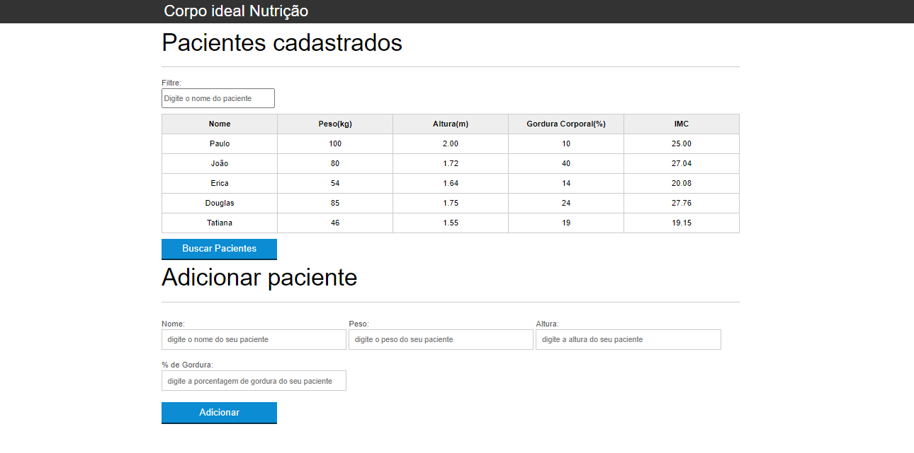
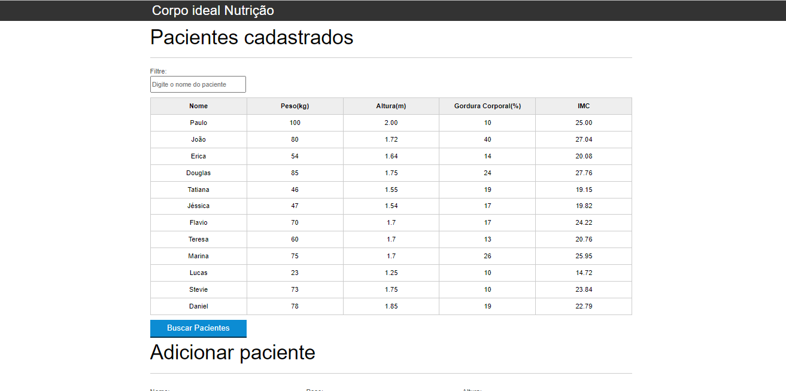
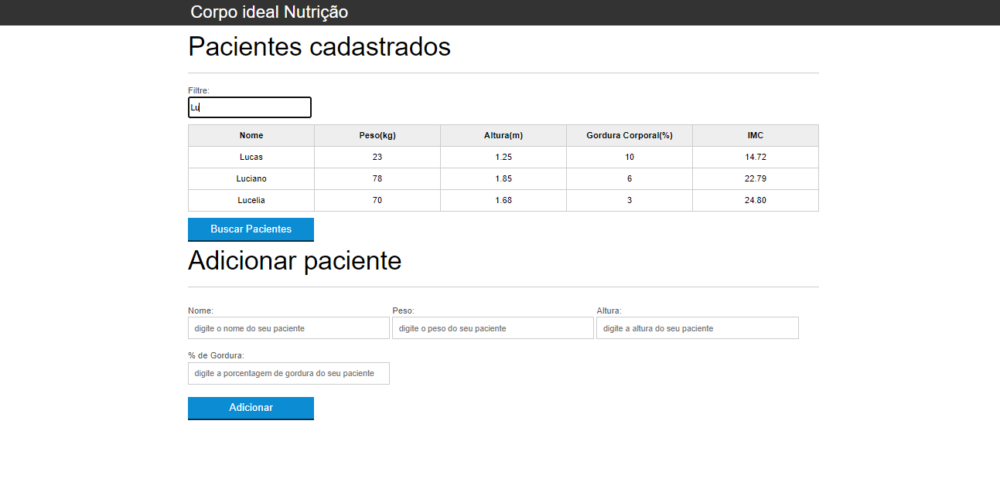

# Tabela de pacientes cadastrados

Projeto feito para adicionar, pacientes em uma tabela e também buscar por pacientes já listados.

## Motivação

Projeto para fins de estudo, aprendizagem e prática em JavaScript, CSS e HTML.

## Tecnologias utilizadas

- JavaScript
- HTML 
- CSS
- Visual Studio Code

## Autor

- Douglas Andrade dos Santos